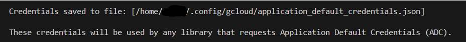

# VisionExample
A small Java application where we use Vision to see a license plate

Note:
This project use cloud resources for computation and requires you either join or create your own acounts to run this project.

### Requirements 
To check that your system can run and build this appilcation locally. in you shell run
```sh
java --version # Must be 17 or higher
gradle --version # Must be 7 or higher (Get 8.6 if you can)
docker --version 
gcloud --version # google-cloud-cli read ahead to get a link to google docs on how to install this 
```

### Setup
Clone this repro.
```sh
git clone https://github.com/mellester/VisionExample.git # Cloning into VisionExample
cd VisionExample # Switching folders into the new cloned folder
cp .env.example .env # Copying the example file into a new one
# open .env in you text editor of choice to be ready for the next step
# ex:  `code .env`
```

VisionService requires google cloud permisons see [google auth login](https://cloud.google.com/docs/authentication/provide-credentials-adc) on how to authenticate you pc
```sh 
gcloud auth application-default login # Creates a json file
```
Partial output

Make sure the `.env` points to the correct location of your GOOGLE_APPLICATION_CREDENTIALS json file

To build the application build each of the modules:

```bash
./DatabaseModule/gradlew build -p DatabaseModule/
./Management/gradlew build -p Management/
./VisionService/gradlew build -p VisionService/
```


Run:
```sh
docker compose build
docker compose up
```

The frontend folder is exposed on http://localhost:8080/

The three services are exposed on the following paths:
* http://localhost:8080/api/rdw
* http://localhost:8080/api/management
* http://localhost:8080/api/vision

If you don't have access to docker you can choose to run the application on e.g. https://labs.play-with-docker.com/
```
apk add openjdk17
git clone https://github.com/mellester/VisionExample.git
```

And run the build scripts


# Progress Notes.
The projects VisionService currently runs on [app.mellesterk.nl](http://app.mellesterk.nl)
ATM. Only the VisionService runs.